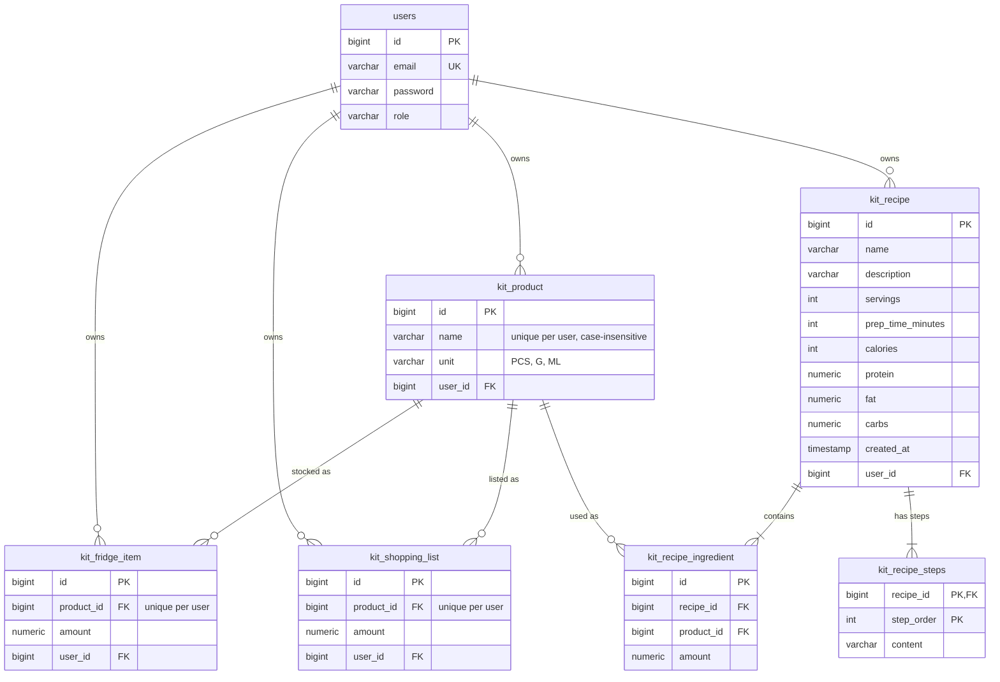

# Assistant

[](https://github.com/Hubserr/Assistant/actions/workflows/ci.yml)

A modular backend for a personal assistant app, built with Spring Boot. It covers three areas of everyday life - **tasks**, **finances** and the **kitchen** - behind a single JWT-secured REST API, with each user's data fully isolated from everyone else's.

## Features

### Tasks
- Create, list, update and delete tasks with a due date and completion flag
- Text search and filtering by completion status, with pagination

### Finance
- User-defined categories (unique per user, case-insensitive)
- Income and expense transactions, filterable by category, type and date range, with pagination

### Kitchen
- **Products created automatically by name** - add `"milk"` to the fridge, a shopping list or a recipe and the product is created on first use (a unit is required only then); `"Milk"` later matches the same product.
- **Ingredient availability statuses** - every recipe ingredient is compared with the fridge and marked `AVAILABLE`, `INSUFFICIENT` or `MISSING`, together with the amount currently available.
- **"Can cook" filter** - `GET /recipes?availability=READY` lists only recipes you can cook right now, `MISSING_INGREDIENTS` the rest; the summary shows how many ingredients are missing.
- **Missing ingredients to shopping list** - one call adds exactly the shortfall (required minus available) of every ingredient to the shopping list.
- **Checkout** - move bought items from the shopping list to the fridge in one transaction, optionally with the amount actually bought; amounts are summed with what is already there.
- **Cook** - subtract a recipe's ingredients from the fridge (items that reach zero disappear). It is never blocked by missing ingredients; instead it returns a shortage report.

## Tech stack

- Java 26, Spring Boot 4 (Web MVC, Data JPA, Security, Validation)
- PostgreSQL 17, Flyway
- JWT authentication (jjwt)
- springdoc-openapi (Swagger UI)
- Lombok
- JUnit 5, Mockito, MockMvc, Testcontainers
- Docker, Docker Compose, GitHub Actions

## Quick start

Requires Docker.

```bash
git clone https://github.com/Hubserr/Assistant.git
cd Assistant
cp .env.example .env
docker compose up
```

The `.env.example` values are development defaults and are safe only for local use. It enables the `demo` profile, which on first start creates a demo account with sample tasks, transactions, a stocked fridge, a shopping list and recipes.

Open Swagger UI: **http://localhost:8080/swagger-ui/index.html**

| Email                | Password   |
|----------------------|------------|
| `demo@assistant.dev` | `demo1234` |

To call secured endpoints in Swagger:

1. Expand `POST /api/v1/auth/login`, click **Try it out** and send:
   ```json
   { "email": "demo@assistant.dev", "password": "demo1234" }
   ```
2. Copy the `token` value from the response.
3. Click **Authorize** at the top of the page, paste the token (without the `Bearer ` prefix) and confirm.
4. All requests now carry the token. A good starting point is `GET /api/v1/kitchen/recipes` - the demo recipes cover all three ingredient statuses.

To start with an empty database, set `SPRING_PROFILES_ACTIVE=` in `.env`.

## Running locally without Docker

Requires JDK 26 and a PostgreSQL database `mydatabase` on `localhost:5432` (for example `docker compose up -d postgres`, or a local installation with the user from `.env`).

```bash
cp .env.example .env    # the app reads DB_USERNAME, DB_PASSWORD and JWT_SECRET from this file
./mvnw spring-boot:run -Dspring-boot.run.profiles=demo
```

Omit `-Dspring-boot.run.profiles=demo` to start without demo data.

## Testing

```bash
./mvnw verify
```

Integration tests run against a throwaway PostgreSQL container (Testcontainers), so only Docker is required - no local database or `.env` file. The same command runs in CI on every push and pull request.

The `http/*.http` files contain end-to-end scenarios with assertions (`auth`, `finance`, `kitchen`) for a running application. Run them from IntelliJ IDEA's HTTP Client or from the command line with [ijhttp](https://www.jetbrains.com/help/idea/http-client-cli.html). They clean up after themselves, so they can be run repeatedly.

## Architecture

The application is a **modular monolith**: each module (`auth`, `task`, `finance`, `kitchen`) is a top-level package containing its entities, repositories, services, controllers and DTOs. Cross-cutting configuration (security, JWT, error handling, OpenAPI) lives in `config`.

Inside the kitchen module, service dependencies point in one direction only: `FridgeService` depends on `ProductService`, `ShoppingListService` and `RecipeService` depend on the fridge, and `CookingService` orchestrates all of them.

### Kitchen data model



## Design decisions

- **Flyway with `ddl-auto=validate`.** The schema is defined only by versioned SQL migrations, including constraints Hibernate cannot express well (check constraints, case-insensitive unique indexes). Hibernate only validates that the entities match, so a mapping mistake fails fast at startup instead of silently altering the database.
- **DTOs never contain entities.** Controllers receive and return DTOs only, and mapping happens in services through static mappers. This keeps the API contract independent of the persistence model, prevents lazy-loading surprises and accidental exposure of fields (such as the owner), and makes it clear which fields a client may set.
- **Data isolation through `findByIdAndOwner`.** Every lookup is scoped to the authenticated user in the query itself. Accessing another user's resource returns **404 instead of 403**, so the API does not reveal whether a given ID exists.
- **No N+1 queries.** Detail views load recipes with their ingredients and products through `@EntityGraph`. The paginated recipe list, which computes ingredient statuses for every recipe, relies on `hibernate.default_batch_fetch_size` to load the collections in batches.
- **A hidden product dictionary.** Users never manage products explicitly; they just type names. Behind the scenes, the fridge, the shopping list and recipes all reference the same per-user product, which is what makes availability checks, "missing to shopping list", checkout and cooking simple lookups by product ID.
- **Non-blocking cook.** Real cooking rarely matches the recipe exactly, so `cook` never fails because something is missing. It consumes what is available and reports the shortages, leaving the decision to the user.

## Roadmap

- AI-generated recipe suggestions based on the current fridge contents
- Receipt import (OCR) to fill the fridge and finance transactions in one step
- Health module (meals, calories, activity)
- Notifications for task deadlines and expiring food

